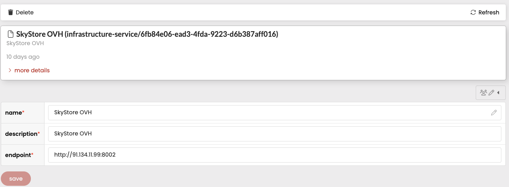
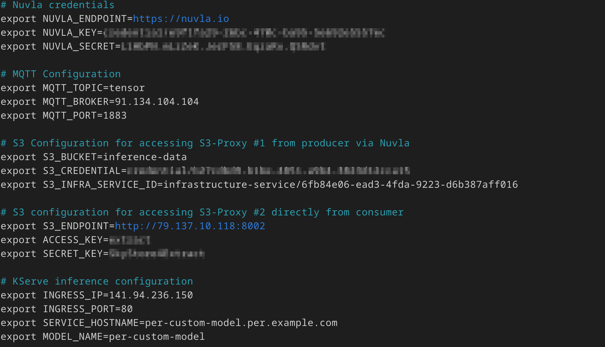

# EXTRACT Joint Demonstrator WP2+WP4
## Propagate Inference Data Over Data Catalog and SkyStore

### Overview
In this demo, the following scenario is demonstrated, combining both DMF Data Catalog (WP2) and SkyStore (WP4) for a full data lake behavior:
1. Starting a DMF data catalog **consumer** in this Jupyter notebook, which subscribes to notifications (MQTT broker) and waits.
2. Starting a DMF data catalog **producer** (separate window). The producer stores inference data on SkyStore S3-Proxy connected to AWS region eu-centeral-1. Producer uses Nuvla to both write the data and register in the catalog, which sends notification
3. The consumer receives the notification and then uses the SkyStore S3-proxy connected to AWS region eu-west-1 to load the data, which causes the data to be propagated to that endpoint.
4. After loading the data, the consumer uses the inference data to perform inference on a model hosted on K8s service in OVH using KServe.
5. The inference result is the final output
   
### 0. Pre-requisites
1. At each setup below, be sure to collect and record all the resulting credentials and environment variables
2. Deploy the sample PER custom model Inference Service. See the instructions at: https://github.com/revit13/per-demo-sept .
3. Deploy SkyStore on Kubernetes following the instructions in https://github.com/gilv/skystore/blob/headbucket/CONTAINER.md . Note that you need to configure 2 S3-proxies with public access (e.g., `LoadBalancer`), each connected to a different S3 storage - can be a local premise (e.g., Minio/Ceph) or a cloud region (AWS, GCP, Azure, etc)
4. Deploy an MQTT broker on K8s with public access
5. Set up a Nuvla account at https://nuvla.io and register the MQTT broker for data notifications on S3 access connected to one of the public S3-proxies you set up at step 2. That S3-proxy will be used for the producer side. The consumer side will use the other S3-proxy. The screenshot below shows an example of registering one S3-proxy in Nuvla: 
6. Organize your collected credentials and environment variables in a single `.env` file organized similar to the example picture below (secret data is obfuscated). Note that this file is not provided in the demo repository because it contains secrets. 

### 1. Setup
1. Clone the repository for this demo from: https://github.com/erezh16/extract-wp24-demo
2. Create and activate a fresh Python venv (Virtual Environment) with Python 3.12 using classic `venv`, `anaconda`, `pyenv`, etc. 
3. All further instructions below are to be carried out from the root folder of the cloned repository
4. Install the dependencies: `pip install -r requirements.txt`
5. Place the `.env` file you created in the pre-requisites in the root folder of the cloned repo.
   
### 2. Run the consumer (notebook)
1. Open a new terminal in the root folder
2. Activate the venv you created during setup
3. Start the consumer notebook. One way is using Jupyter: `jupyter notebook/wp24.ipynb`. You can also open the folder with `vscode` and click on `notebook/wp24.ipynb`.
4. Run the notebook in the cell order. It should block at cell 6, waiting for the producer to store data and generate a notification.

### 3. Run the producer (script)
1. Open a new terminal in the root folder
2. Activate the venv you created during setup
3. Run the script `./produce.sh`. It should store the file `reduced_tronchetto_array.pt` as an object on the S3 storage connected to the S3-proxy that you registered on Nuvla.

### 4. Finish the demo - consumer notebook
1. Go to the open notebook again. You will see that the notebook finised cell 6 as it received the DMF notification
2. Execute remaining cells in order
3. The inference result should be printed as a list of values in the end of the notebook execution.

 

 

